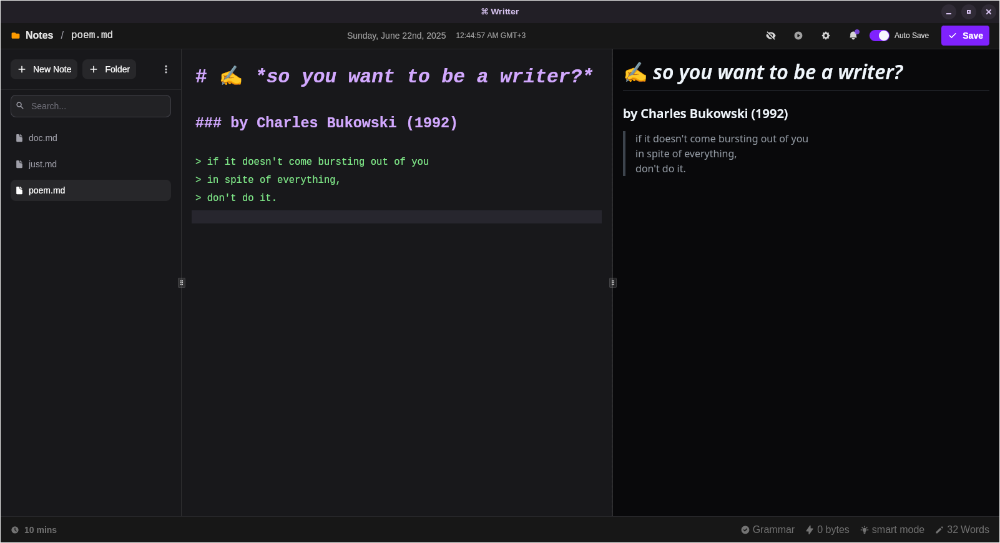

# ⌘ Writter

The minimalistic markdown editor for your notes and thoughts!



**Writter** is your dedicated writing app for notes, letters, poems, journal and documentation — all powered by Markdown, with a focus on simplicity, speed, and total control.

> **Version:** v0.0.6 Beta

---

## Why Choose Writter?

Well, most editors around are focused on non technical people, they have drag and drop and notion style experience which is all good, but that is a bit limitting to a technical person who just wants to document things up easily and with full control, now this is where writter comes in, create your markdown files and do anything you want with them, a cloud backup solution will be available but just optional. This geared towards local first, simplicity and full control over how you write your stuff.

---

## ✨ What You Get

- **Lightning-Fast Writing Experience**  
  Start writing instantly—Writter opens your projects and notes in a snap, so you never lose your creative flow.

- **Live Markdown Preview**  
  See your formatted content as you type. Write with confidence and clarity, knowing exactly how your work will look.

- **Effortless File Organization**  
  Manage all your notes and documents in tidy folders. Create, rename, and delete files with a click.

- **Auto-Save & One-Key Saving**  
  Never lose your work. Writter saves automatically, and you can hit <kbd>Ctrl+S</kbd> or <kbd>Cmd+S</kbd> anytime for peace of mind.

- **Always Know Your Word Count**  
  Stay on top of your productivity with real-time word counts, perfect for meeting deadlines or goals.

- **Built for Focus**  
  A clean, intuitive sidebar and keyboard shortcuts keep you productive—no distractions, just your words.

- **Seamless Project Switching**  
  Jump between projects with ease. Writter remembers your last opened folder for a seamless workflow.

- **Instant Feedback**  
  Get clear, friendly notifications when you save, organize, or manage your notes.

---

## 🚀 Coming Soon

- **Sync Across Devices**  
  Securely back up and access your notes from anywhere with optional cloud sync.

- **Drag-and-Drop Note Reordering**  
  Organize your notes exactly how you want with intuitive drag-and-drop.

- **Folder Creation**  
  Build custom folder structures to match your projects and thinking style.

- **Settings Panel**  
  Personalize Writter to your workflow with user-friendly settings.

- **Markdown Guide, Spellcheck, and AI Assistance**  
  Write smarter and faster with built-in guides, error correction, and smart suggestions.

- **Music Player Integration**  
  Set the mood while you write—right inside Writter.

- **Web Version**  
  Take your writing anywhere, on any device.

---

## Getting Started

1. **Clone the Repo**
2. **Install dependencies:**  
   ```sh
   pnpm install
   ```
3. **Start the app:**  
   ```sh
   pnpm tauri dev
   ```

---

## 💡 Tech Stack

- **Vite**
- **React**
- **Tailwind CSS**
- **shadcn/ui**
- **CodeMirror**
- **React Markdown**
- **Tauri**
- **Supabase** — Will be used for optional cloud sync (coming soon)

---

## Contributing

Writter is a beta-stage, open-source side project—contributions and ideas are welcome!  
Reach out: [hssnkizz@gmail.com](mailto:hssnkizz@gmail.com)

> **Note:** This app is under active development. Please expect bugs and missing features, and thank you for your interest and support!
