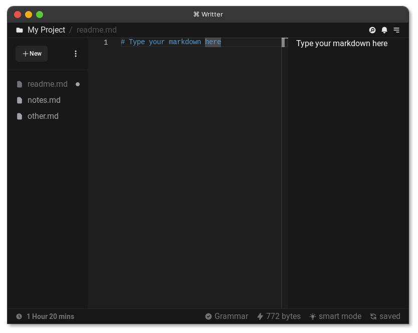

# ⌘ Writter

An editor for technical writting, blogging and note taking using markdown.

> Version: v0.0.1 Alpha

## Why?

well why not, most editors around are focused on non technical people, they have drag and drop and notion style experience which is all good, but that is a bit limitting to a technical person who just wants to document things up easily and with full control, now this is where writter comes in, create your markdown files and do anything you want with them, a cloud backup solution will be available but just optional. This geared towards local first, simplicity and full control over how you write your stuff.

## Features And Roadmap

- Save files locally
- Sync files accross devices and cloud backup
- All markdown feature support
- AI auto completions (smart mode)
- Spell and grammar checking
- Auto save feature
- Intuitive UI
- File Size
- Builtin markdown guide
- Web Version
- Keyboard shortcuts

## Development

 Setup: clone repo, `pnpm install` and then `pnpm run dev2` to start development server!

## Project Tech Stack

- Monaco Editor (Vscode Editor Engine, Used For Editing Markdown)
- Tauri (Rust + Webview Desktop Development Framework)
- Supabase Backend (For Cloud Backups Infrastructure)
- React Js + Vite (With Typescript, Frontend)
- Shadcn UI Tailwind CSS components library (New York Style)
- Eslint (Recommended Settings)
- Prettier (With Tailwind Plugin To Auto Sort Classes)
- Better Commits (CLI Tool For Conventional Commits Compliance)

And Others Based On [Sleek Stack](/SleekStack.md)

## What Next?

Well this is my side project and open source so feel free to contribute, reach to me at [hssnkizz@gmail.com](hssnkizz@gmail.com) for any ideas or so, this is work in progress too, don't over expect at this point, thanks!